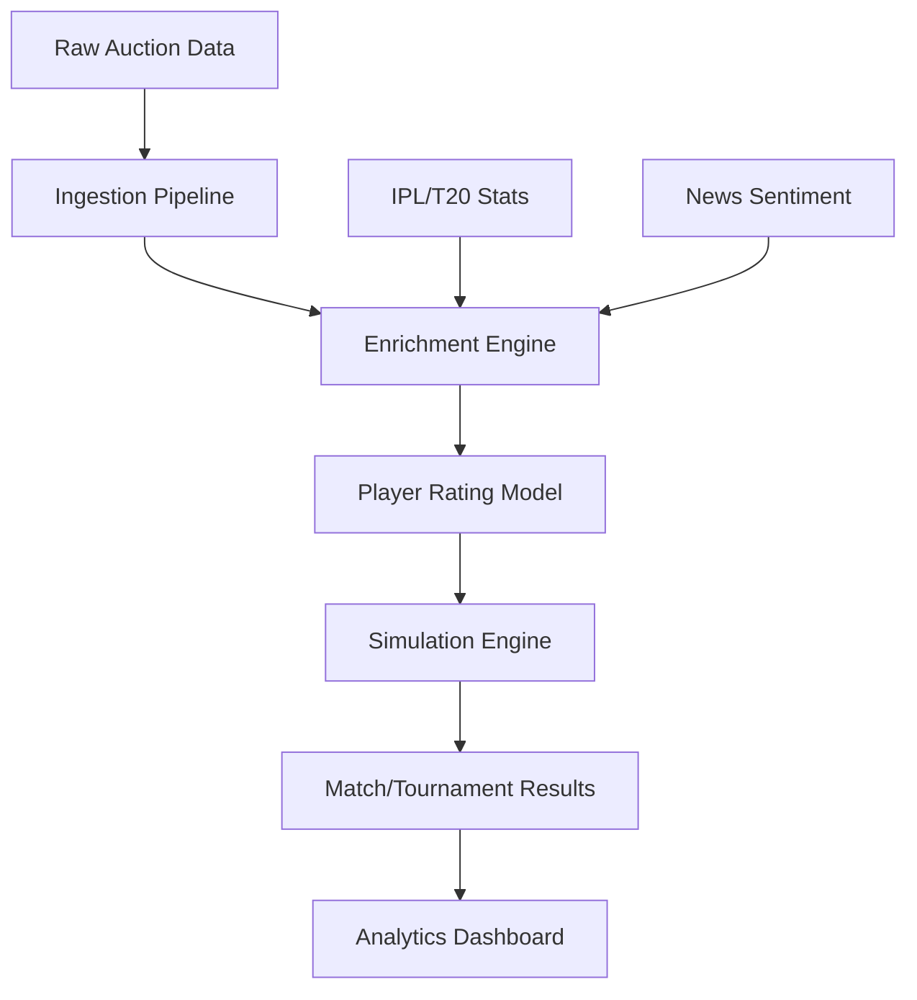

# IPL Auction Simulator 🏏

[](https://www.python.org/downloads/)
[](https://nextjs.org/)
[](https://opensource.org/licenses/MIT)

A sophisticated, probabilistic T20 cricket simulation engine built using real-world IPL data, player statistics, and news sentiment analysis. This project takes raw auction data and transforms it into a full-scale tournament simulator with a modern, data-dense analytics dashboard.

---

## 🚀 Overview

The **IPL Auction Simulator** is more than just a random score generator. It uses a multi-layered rating engine to calculate player performance probabilities across different match phases (Powerplay, Middle, Death) and specific matchups (Pace vs. Spin).

### Core Components:
1.  **Data Ingestion**: Extracts player information from auction CSVs and raw datasets.
2.  **Stat Enrichment**: Fetches 5-year historical IPL and T20 stats, recent 12-month form, and real-time news sentiment.
3.  **Rating Engine**: Computes weighted ratings (0-100) based on role-specific metrics.
4.  **Simulation Engine**: A ball-by-ball T20 match engine that simulates innings based on probabilistic distribution of outcomes (runs, wickets, extras).
5.  **Analytics Dashboard**: A high-performance Next.js frontend to visualize team strengths, match results, and tournament standings.

---

## 🏗️ Architecture



---

## 🛠️ Tech Stack

### Backend (Python)
- **Engine**: Probabilistic match simulation using role-weighted distributions.
- **Data**: CSV processing, OCR extraction for raw auction sheets.
- **Rating**: Multi-factor weighting (60% IPL, 25% T20, 15% Recent Form).

### Frontend (Next.js)
- **Framework**: Next.js 15 (App Router) + TypeScript.
- **Styling**: Vanilla CSS with a focus on high-density, "ESPN-style" sports analytics UI.
- **Design**: Dark theme, Inter/Outfit typography, and Apple-inspired aesthetics.

---

## 📥 Installation

### 1. Clone the repository
```bash
git clone https://github.com/Sanjeev2007/IPL-Auction-Simulator.git
cd IPL-Auction-Simulator
```

### 2. Backend Setup
```bash
# Recommendation: Use a virtual environment
python -m venv venv
source venv/bin/activate  # On Windows: venv\Scripts\activate

pip install -r requirements.txt
```

### 3. Frontend Setup
```bash
cd web
npm install
```

---

## 🎮 Usage

### Running the Backend Pipeline

The simulator runs in distinct phases:

1.  **Ingestion**: `python scripts/run_ingestion.py`
2.  **Enrichment**: `python scripts/run_enrichment.py`
3.  **Rating**: `python scripts/run_rating.py`
4.  **Simulation**: 
    - Single Match: `python scripts/run_simulation.py`
    - Full Tournament: `python scripts/run_tournament.py`

### Viewing the Dashboard

```bash
cd web
npm run dev
```
Navigate to `http://localhost:3000` to view the live simulator and analytics.

---

## 📊 Detailed Modules

### Player Rating Model
Ratings are calculated on a 0-100 scale using:
- **Batting**: Avg (35%), SR (30%), Volume (20%), Boundary % (15%).
- **Bowling**: Economy (30%), SR (30%), Wickets (25%), Consistency (15%).
- **Phase Specialization**: PP/Middle/Death specific ratings.
- **Matchup Advantage**: Specific boosts for Pace vs. Spin suitability.

### Simulation Engine
- **Ball-by-ball resolution**: Every delivery is simulated based on batter vs. bowler ratings.
- **Wicket fall probabilities**: Derived from bowler strike rates and batter stability.
- **Target Chasing**: Smart AI for second innings to adjust aggression based on RRR (Required Run Rate).

---

## 📈 Roadmap
- [x] Core Simulation Engine
- [x] Multi-source Stat Enrichment
- [x] Next.js Dashboard v1
- [ ] Live Ball-by-ball Streaming Mode
- [ ] Team Strength Balancer (AI-based Trades)
- [ ] Multi-season Career Progression Simulation

---

## 📄 License
This project is licensed under the MIT License - see the [LICENSE](LICENSE) file for details.
