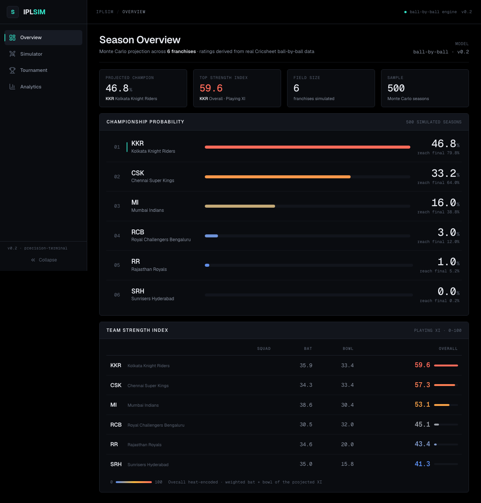
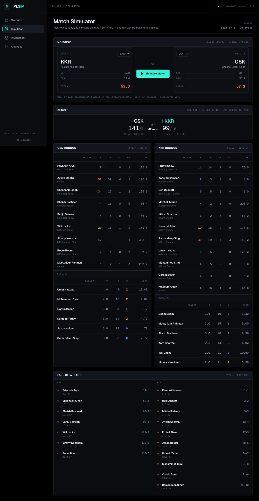
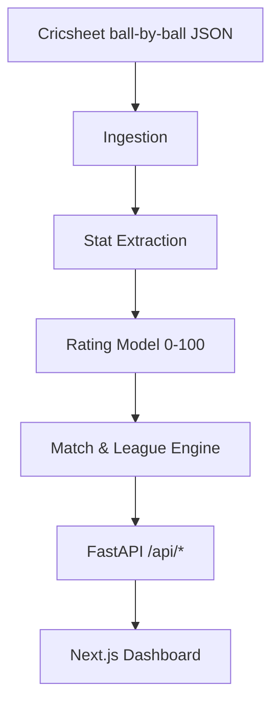

# IPL Auction Simulator 🏏

[](https://ipl-auction-simulator-b37e.vercel.app/)
[](https://www.python.org/downloads/)
[](https://nextjs.org/)
[](LICENSE)

**Live demo → https://ipl-auction-simulator-b37e.vercel.app/**

A ball-by-ball **T20 cricket simulation engine** built on real [Cricsheet](https://cricsheet.org)
match data. It derives 0–100 player ratings from historical ball-by-ball deliveries, then runs a
probabilistic match engine to simulate individual games and full IPL-style tournaments (league +
playoffs) — served through a FastAPI backend and a dense, terminal-styled Next.js dashboard.

> **Where it's headed:** the long-term goal is an auction-first flow — friends draft players into
> teams (any number of teams), then simulate the tournament. The simulation engine already supports
> a dynamic team count; a live multiplayer auction is the next phase (see [Roadmap](#-roadmap)).

### Screenshots

**Season overview** — Monte Carlo championship odds + heat-encoded team strength:



**Match simulator** — pick a matchup, get a full ball-by-ball scorecard:



---

## 🚀 How it works

1. **Ingestion** — parse raw Cricsheet ball-by-ball JSON into a normalized delivery dataset.
2. **Stat extraction** — compute batting/bowling stats per player directly from real deliveries
   (career, other-T20, and trailing-form windows), plus phase splits (powerplay / middle / death)
   and matchup splits (vs pace / vs spin).
3. **Rating model** — blend those into 0–100 ratings:
   `rating = 0.60 × IPL + 0.25 × other-T20 + 0.15 × recent form`.
4. **Simulation engine** — a ball-by-ball T20 engine resolves each delivery from batter-vs-bowler
   ratings and phase context, producing full scorecards; a league engine runs seasons (double
   round-robin + N-aware playoffs) and aggregates championship odds over many simulations.
5. **API + dashboard** — FastAPI exposes the engine; the Next.js dashboard visualizes odds, team
   strength, live match scorecards, and tournament standings.



---

## 🛠️ Tech stack

**Backend (Python)**
- Ball-by-ball probabilistic match + tournament engine (~5,200 LOC, typed).
- Ratings derived from real Cricsheet data; role-weighted, phase- and matchup-aware.
- **FastAPI** serving `/api/*`; pandas / numpy for the data pipeline.

**Frontend (Next.js)**
- **Next.js 16** (App Router) + **React 19** + **TypeScript**.
- **Tailwind CSS v4**, **framer-motion** (motion), **recharts** (charts), **lucide-react** (icons).
- Design: **"Precision Terminal"** — a dark, data-dense look (pure-black canvas, tabular mono
  numerics, heat-encoded ratings). Typography: Clash Grotesk (display) / Geist (UI) / Geist Mono (data).

---

## 📥 Getting started

The enriched player data (`data/enriched/*.csv`) and team lineups are committed, so the API and
dashboard run **out of the box** — you only need the raw Cricsheet data if you want to regenerate
ratings (see [Regenerating ratings](#-regenerating-ratings-from-raw-data)).

### 1. Clone
```bash
git clone https://github.com/Sanjeev2007/IPL-Auction-Simulator.git
cd IPL-Auction-Simulator
```

### 2. Frontend (dashboard)
The dashboard is a **static site** — the engine's output is pre-generated to JSON
(committed under `web/src/data/` + `web/public/data/`), so it runs standalone with
no backend:
```bash
cd web
npm install
npm run dev        # → http://localhost:3000
```

### 3. Run the engine / API (optional)
The Python engine and its FastAPI server aren't needed to view the dashboard — they
power the CLI runners and regenerate the site's data:
```bash
python -m venv .venv
source .venv/bin/activate               # Windows: .venv\Scripts\activate
pip install -r requirements.txt

python scripts/run_simulation.py        # one detailed match + 100-match distribution
python scripts/run_tournament.py        # 1 verbose season + 500 seasons of aggregate odds
uvicorn src.api.server:app --port 8000  # optional live API at /api/*
```

---

## 🌐 Deploy

The dashboard deploys as a **static site on Vercel** — no server, no backend:

- Import the repo on Vercel, set **Root Directory → `web`**. That's it.
- To refresh the data (odds, tables, match pool) from the engine, run
  `python scripts/build_web_data.py` locally and commit the regenerated JSON.

---

## 🔬 Regenerating ratings from raw data

Ratings ship pre-computed. To rebuild them from scratch on real Cricsheet data:

```bash
python scripts/run_real_enrichment.py   # ingest deliveries → stats → ratings (derived_scores.csv)
```

This is the real, default enrichment path. (The legacy `run_enrichment.py` /
`stat_generator.py` produced synthetic placeholder data and are **deprecated** — kept only for
reference and clearly marked in code.)

---

## 📊 Details

**Rating model (0–100)**
- Batting and bowling ratings blend IPL (60%), other T20 (25%), and recent form (15%).
- Phase-specific ratings: powerplay / middle / death.
- Matchup ratings: vs pace / vs spin.

**Simulation engine**
- Ball-by-ball resolution: each delivery drawn from batter-vs-bowler ratings and phase context.
- Full scorecards: batter cards, bowling figures, fall-of-wickets, per-over run rate.
- Tournament: double round-robin league + playoffs that scale to the team count (2 → final,
  3 → eliminator + final, 4+ → full Qualifier/Eliminator bracket), aggregated over 500 seasons.

**Current data:** 223 players and 6 team lineups (CSK, MI, RCB, KKR, SRH, RR). The engine itself is
team-count-agnostic — arbitrary rosters can be supplied via `POST /api/simulate_season`.

---

## 📈 Roadmap
- [x] Ball-by-ball match + tournament engine
- [x] Ratings derived from real Cricsheet data
- [x] Dynamic team count (N-aware playoffs)
- [x] "Precision Terminal" analytics dashboard
- [x] Deployed — [live on Vercel](https://ipl-auction-simulator-b37e.vercel.app/)
- [ ] Live multiplayer auction — draft rosters, then simulate

---

## 📄 License

MIT — see [LICENSE](LICENSE).
